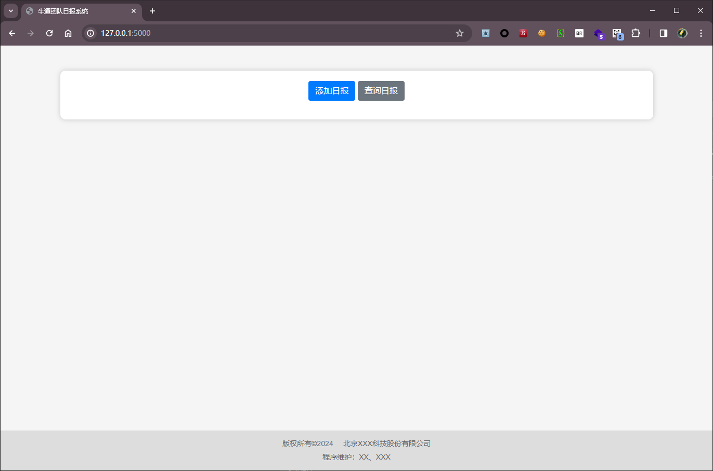
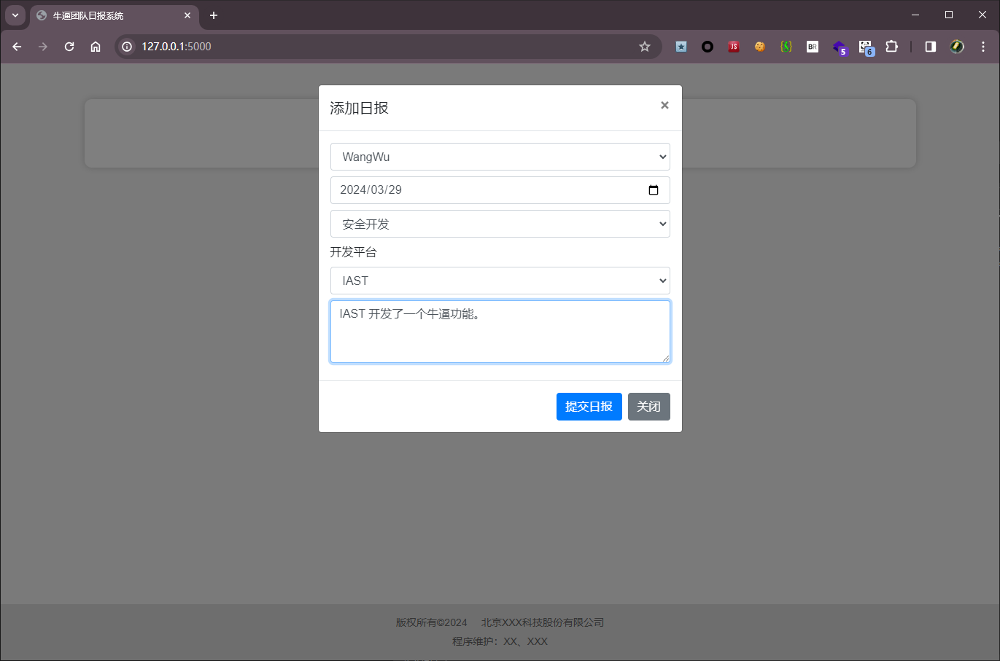
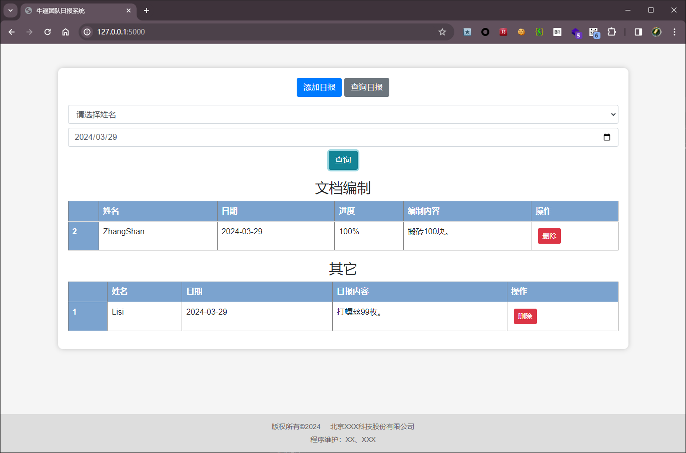

# Introduce
用来在内网搭建一个简易的日报系统，让团队成员采用模板化提交每日的日报，自动汇集到Excel。

适合团队负责人使用，简单易用、好上手。
负责人只需要固定好Excel模版，定好工作类型和量，成员就可以按照要求的模版，提交自己的工作日报。

自动集成道Excel表格。 省时省力。

# Technology Selection
后端:  Python + Flask

前端： HTML + Bootstrap + Jquery

存储： Excel

功能：
- 增加日报
- 查询日报
- 删除日报

# Note
创建

# Preview
首页

添加日报

查询日报

